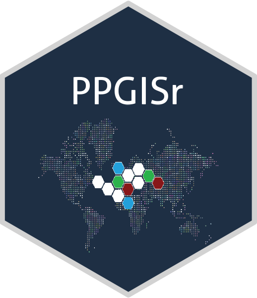

# PPGISr <a href="https://github.com/GLISA-umich/PPGISr"></a>

[](https://www.repostatus.org/#active)

Welcome to PPGISr, an R package for Public participatory GIS (PPGIS).

Welcome to PPGISr, an R package for Public participatory GIS (PPGIS).

### Run an example map

PPGISr comes with a sample map that loads as default. The example map
provides an area of Minnesota and three land cover categories to choose
from.

``` r
PPGISr::run_app()
```

### Create your own categorise

You can also suggest which categories you would like to map (e.g. land
use, environmental and social vulnerabilities).

``` r
PPGISr::run_app(mapping_categories = c("Trees", 
                                       "Flowers",
                                       "Water"))
```

### Create your own colors

It is also possible to add colors that corresponds to these categories

``` r
## This must be a vector of the same length as the mapping categories
run_app(mapping_categories = c("flowers", "lake", "trees"),
        mapping_colors = c("green", "red", "blue"))
```

### Add your own editable map

Users can specify the editable map layer, allowing for different
locations and regular geographic units with a desire resolution
(e.g. census tract, regular tessellation) for decision-making

``` r
## We recommend using the sf library to load spatial vector data
library(sf)
## Spatial data should use World Geodetic System 1984 (WGS84) coordinate reference system(crs)
editable_map <- st_read(system.file("shape/nc.shp", package="sf"))

run_app(editable_map = editable_map, base_map = NULL)
```
